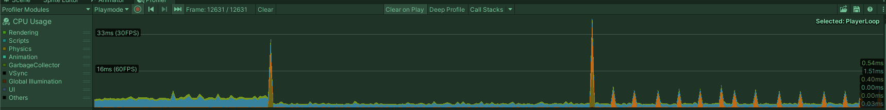

# Unity-2D-Tilemap-Side-Scrolling-study

This repository contains a simple demo Unity project that was born to compare performance of different solutions implementing a very basic classic side scroller where the scrolled terrain is built up from a Grid + Tilemap + Rigidbody 2D + Tilemap Collider 2D + Composite Collider 2D

It contains 3 scenes
- PlatformMovesScene
  - a very simplified version of the implementation I used originally, this one moves the (kinematic) Rigidbody of the tilemp via Rigidbody2D.MovePosition
- CameraMovesScene
  - this one is using a Unity built in Camera stack where the cameras are moving only with different speed creating the parallax effect (also uses a Cinemachine camera to follow the player according to my special requirements, see bellow in details)
- CVCCameraGhostTargetFollowScene
  - this one uses a special Cinemachine camera setup to be able to follow the player and support the parallax effect at the same time (according to my special requirements, see bellow in details)

A bit more details.

My first implementation contained multiple layers with parallax effect added too where the top most of those layers contained the above mentioned tilemap.
The layers (actually their content, but it does not matter) simply were moved by transform.Translate() with various speed based on their distane from the camera, it also used a Cinemachine Virtual Camera as well as that provides a beautiful, smooth target following effect (i set it up to follow my player object using a "Framing Transposer" with tight freedom of soft and hard zones. The reason why I emphasize this is that I wanted to keep this nice effect in any other possible implementations)

In that original version, based on my false assumptions, I simply moved that foremost layer just like the others (that do not have any rigidbodies or colliders attached to) and I did not pay attention on how really the rigidbodies are allowed to be moved. (actually it was a static rigidbody that is not allowed to be moved at all, that is why it is called static :D )
This led me a very poor performance that is nicely confirmed in Unity profiler. (interesting fact that it still mostly performed with 60 fps on my nowadays oldscool late 2013, 15'' MacBook Pro, so huge grats to the Physics sytem developers that the Unity Physics system was still able to perform acceptable even if i did my best to make its job the hardest possible with my extremely false implementation, usage)

My first thought was I should try a different method to get it perform better therefore I started to play with how it could be implemented using camera moving only.
The frist version of that used at the end Unity camera stacks where dedicated cameras rendering the given layers and the cameras are moving by the required speed to get the platform move (and parallax effect), This version also used a Cinemacine camera as I did not want all the time to lose the really nice "Framing Transposer" caused effects (note, unfortunately i still was not able to mimic fully it neither with this nor with the third solution bellow)

The second version performed much better (especially after i removed the unnecessary cameras from the camera stack, one more thing I've learnt is that, of course, rendering multiple cameras has its cost too (such a surprise, is not it? ;) ), but as i mentioned I could not fully mimic the original "Framing Transposer" effect so I started to investigate a more Cinemacine Camera focused solution. I got a very huge help in the [Cinemachine](https://forum.unity.com/forums/cinemachine.136/) Unity forum from [Gregoryl](https://forum.unity.com/members/gregoryl.1242385/), based on that I've added the basic implementation of the third version that uses a ghost gameobject that is followed by the Cinemachine camera on a tricky way.
This version performs the best now, but still cannot mimic the loving "Framing Transposer" effect (actually even a bit worth than the second version can provide as I could not find a proper y dumping value that is even close to the one in the second version)

Here you can see a comparision chart of the 3 solutions actual performance.
 
(The 2 huge spikes are just the scene changes, the first 1/3 of the chart is about the Camera stack moves scene, second 1/3 is about the ghost Cinemachine follow target camera scene and the last 1/3 is about the rigid body moves scene, note that (not surprisingly) moving the single cinemachine camera performs the best as the camera stack rendering of course takes much time in the second case, also note that moving the rigidbody still performs really nice overall (after I fixed it based on [MelvMay](https://forum.unity.com/members/melvmay.287484/)'s suggestions) as it is still under 6ms on average!)

I hope this would help someday for someone to spare some time or just learn new things like it did for me!

I wish i could say that i found a, for me at least, fully satisfying solution but at least I've definitely learned a lot again ;)

Related Unity forum discussions:
- https://forum.unity.com/threads/optimizing-even-more-tilemap-colliders.1197712/#post-7658578
- https://forum.unity.com/threads/how-to-move-a-virtual-camera-with-a-target-framing-transposer.1189591/

Special thanks to [MelvMay](https://forum.unity.com/members/melvmay.287484/) and [Gregoryl](https://forum.unity.com/members/gregoryl.1242385/) to help clarifying my concerns, pointing out my faults in my original implementations and being patient and helpful with an absolute Unity beginner.
